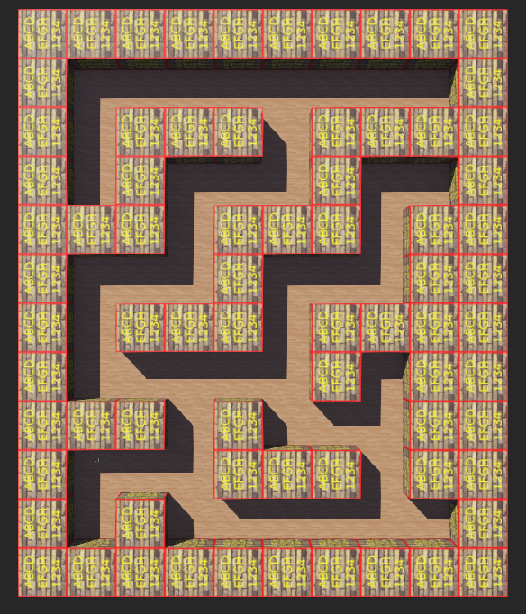
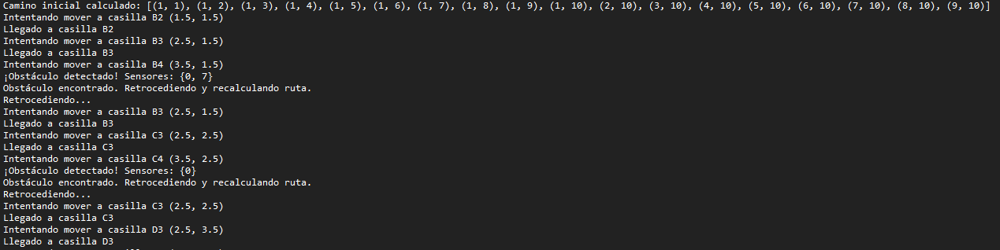
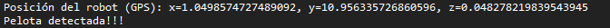

# EntregaWebots
## Tabla de Contenidos
1. [Introducción](#Introduccion)
2. [Controlador A*](#A*)
3. [SigueParedes con GPS](#Sigueparedes)
4. [Conclusión](#i4)
## Introducción 
Tal y como se meciona en el guión se genera un laberinto de tamaño 10x12 (Según mi nombre) utilizando la herramienta proporcionada. El mapa es el siguiente:

Se posicion el robot (e-puck) en el inicio (1.5,1.5). Por lo que se determina que el punto final se encuentra en la coordenada (8.5,10.5) ya que es la esquina opuesta. Para resolver este laberinto se han llevado a cabo 2 controladores para poder compararlos entre si. Ambos cuentan con enlace a video para ver su desempeño. 

## Controlador A* 
### Video
[Enlace](https://youtu.be/kf7UdsoY8r0)

### Características Principales
- Implementación del algoritmo A* para encontrar el camino óptimo desde el punto inicial hasta la meta.
- Actualización continua de la posición del robot en base a los valores de los sensores de posición.
- Uso de los sensores de proximidad.
- Si el robot encuentra una celda no trasnistable retrocede y recalcula una nueva ruta para alcanzar el objetivo.

### Componentes del Código

#### 1. **Configuración del Robot**
- Se inicializan el robot, los sensores de proximidad y posición, y los motores.
- Se definen parámetros geométricos del robot e-puck como el radio de las ruedas y la separación entre ellas.
- Se configura una representación del laberinto en una matriz de 10x12.

#### 2. **Algoritmo A***
- Se utiliza una cola de prioridad (`heapq`) para explorar las celdas del laberinto.
- Se calcula el costo total como la suma del costo hasta la celda actual y la heurística (distancia Manhattan al objetivo).
- Se almacena el camino recorrido en un diccionario `came_from` y se reconstruye la ruta desde la meta hasta el inicio.

#### 3. **Odometría**
- Se actualizan las coordenadas `(x, y, theta)` del robot basándose en la diferencia de posición de las ruedas.
- Se consideran los desplazamientos diferenciales para estimar la nueva ubicación del robot en el entorno.

#### 4. **Detección de celdas no trasnitables**
- Se revisan los valores de los sensores de proximidad para detectar si el robot está cerca de una celda no transitable. Si se detecta, se añade su ubicación a la matriz del laberinto y se recalcula la ruta.

#### 5. **Movimiento del Robot**
- **Reorientación**: Se calcula el ángulo de dirección hacia la siguiente celda y se ajusta la velocidad de los motores para girar correctamente.
- **Desplazamiento**: Se mueve el robot hacia la siguiente casilla asegurándose de no desviarse del camino planificado.
### Terminal de Salida
Aqui podemos ver un fragmento de la terminal de salida de este controlador, se puede apreciar como va calculando la ruta al destino.

## SigueParedes con GPS 
### Video
[Enlace](https://youtu.be/G5IKbE7ssrU)
### Descripcion
Este controlador tiene como finalidad localizar una pelota verde y mandar la posición de la misma. 
### Uso del turretSlot
El e-puck no tiene incorporado un GPS por lo que se le añade uno. 

### Lógica del Programa
1. **Inicialización**: Se configuran los dispositivos y sensores del robot.
2. **Detección de objetos verdes**: Se analiza la imagen capturada por la cámara para detectar la presencia de color verde.
3. **Seguimiento del objeto**:
   - Si el objeto verde se encuentra en la izquierda, el robot gira hacia la izquierda.
   - Si el objeto está en la derecha, el robot gira a la derecha.
   - Si el objeto está en el centro, el robot avanza en línea recta.
4. **Seguimiento de pared**:
   - Si el robot no detecta nada verde sigue la pared. 
5. **Detención**: Si el porcentaje de verde en la imagen supera el umbral definido (50%), el robot se detiene completamente.
### Terminal
Va mostrando la posicion del GPS y finaliza avisando de que ha llegado a la pelota.

## Conclusion 
Ambos algoritmos logran alcanzar la meta, pero presentan ciertas limitaciones:
### 
A*: Al depender de la odometría, tiende a acumular errores a lo largo del recorrido, a pesar de los esfuerzos por minimizar este efecto. ¿Funcionaría mejor con GPS? En teoría, sí, pero solo en esta simulación, donde el GPS no introduce error (aunque en Webots se puede añadir). En un entorno real, los GPS suelen tener un margen de error superior a un metro, lo que los haría poco útiles para este propósito.
### 
Algoritmo de seguimiento de paredes: Su lógica es más sencilla y se puede mejorar fácilmente para reducir colisiones innecesarias contra las paredes. Sin embargo, este tipo de enfoques presentan el riesgo de quedar atrapados en bucles, girando alrededor de "islas" dentro del laberinto sin encontrar la solución.

